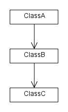
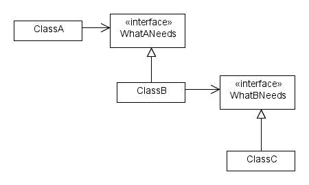
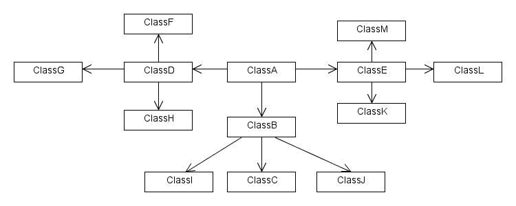
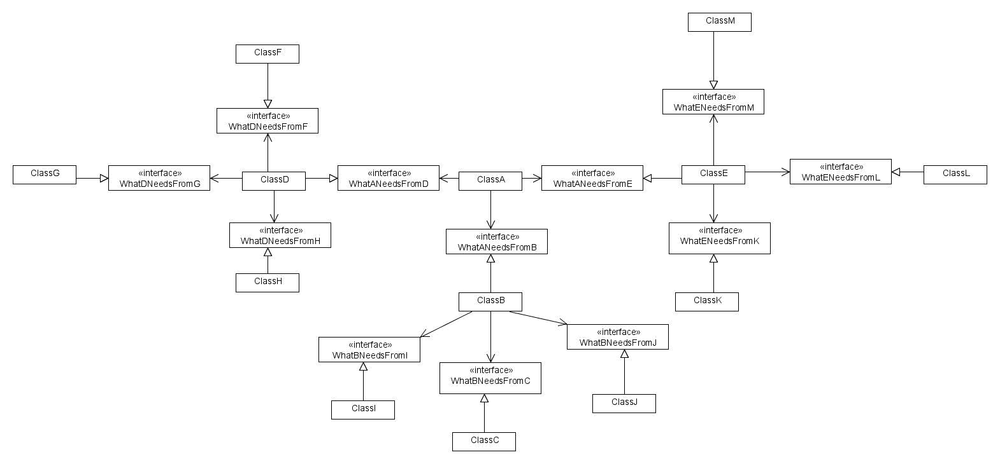

#Dependency Inversion Principle

This information can also be found in the book Agile Software Development,
Principles, Patterns, and Practices by Robert C. Martin.
He also has a very useful heuristic that can help you learn the Dependency
Inversion Principle.

The Dependency Inversion Principle is also known as
- Inversion of Control
- The Hollywood Principle (don’t call us, we’ll call you)

The problem is that as more features are added to a program, the harder it
gets to change.  This is mainly because of the interdependencies of the
classes that get added.
To understand a single class, you must understand all of the classes it
depends on, and the classes they depend on, and so on.
We feel the pain of this because although features are added linearly, the
cost to change the code increases exponentially.  This means that over
time, adding features of the same complexity costs more time and manpower.

Consistently applying the dependency inversion principle fixes this by
managing the complexity.

Consider a typical dependency structure.

In order to understand ClassA, you must understand ClassB and ClassC.  So
the complexity involved is 3 classes.

Now consider what happens when the dependencies are inverted.

To understand ClassA, you only need to understand the interface it depends
on.  So the complexity involved is 2 classes.  Reducing the complexity of
understanding a single class by introducing two more may seem like a waste
of effort.  In the first case you only had 3 total classes, now you have 5.
That is until you take into account how the complexity scales as more
classes are added.  For testing, you only have to mock 1 object, while in
the earlier case, you have to mock 2.

Lets look at what happens when each class has 3 dependencies rather than 1.

Now to understand ClassA, you have to understand 12 other classes as well,
so the total complexity is 13.
Consider the same structure when applying the Dependency Inversion
Principle.

Now instead of having 13 classes we have 25 classes, so the total number of
classes nearly doubled.  But what about complexity?  How hard is it to
understand ClassA?  You can see that ClassA only knows about 3 interfaces,
so the complexity involved is 4.  Also notice that no matter how many extra
classes are added on because of new features, the overall complexity of any
given feature levels out rather than growing exponentially.  Although the
number of classes increased from 13 to 25, the actual complexity reduced
to 4.  For testing, you go from having to mock 12 objects, to only having to
mock 3.

## Advantages
- Design empirically determined based on needs of the caller
    - Not the speculative process of predicting what the library will need
- By depending on abstractions instead of implementations, it is easy for tests to replace dependencies with fakes/stubs/mocks, so each test only has to worry about its subject.
- Partitions and isolates parts of the code from each-other
    - When maintaining the code, it is easier to focus on only the parts relevant to you, as details can be hidden behind the dependency contract.

## Notes from the book
- What is inverted?
    - The idea that high level modules depend on low level modules
    - Low level modules affect the design of high level modules
- Dependency is transitive
- Inversion of ownership
- It is ok to depend on concrete modules as long as they are not volatile
    - For example, String
