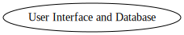
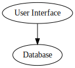

### No Architecture

<a href="no-architecture.svg">no architecture</a>

### Make Cohesive

<a href="make-cohesive.svg">make cohesive</a>

### Decouple

<a href="https://raw.githubusercontent.com/SeanShubin/documentation/master/wiring/decouple.svg">decouple</a>
